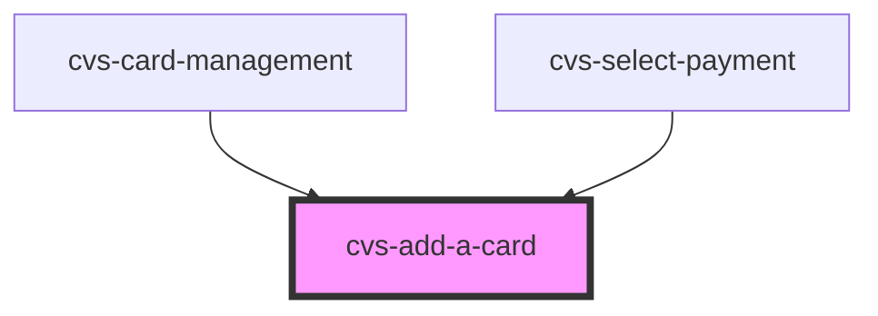

# cvs-add-a-card

<!-- Auto Generated Below -->

## Properties

| Property      | Attribute       | Description                  | Type     | Default     |
| ------------- | --------------- | ---------------------------- | -------- | ----------- |
| `addCardText` | `add-card-text` | text to display for add card | `string` | `undefined` |

## Events

| Event            | Description                                                              | Type               |
| ---------------- | ------------------------------------------------------------------------ | ------------------ |
| `routeToAddCard` | onClick notify next.js app to router.push() to appropriate add-card page | `CustomEvent<any>` |

## Dependencies

### Used by

 - [cvs-card-management](../cvs-card-management)
 - [cvs-select-payment](../cvs-select-payment)

### Graph

----------------------------------------------

*Built with [StencilJS](https://stenciljs.com/)*
