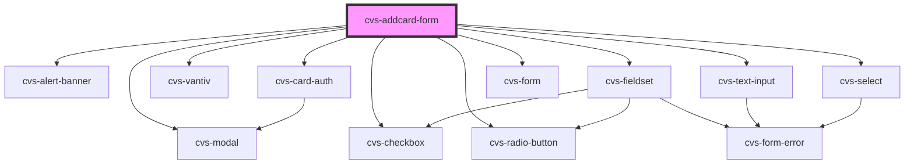

# cvs-addcard-form

<!-- Auto Generated Below -->

## Properties

| Property                   | Attribute       | Description                        | Type     | Default     |
| -------------------------- | --------------- | ---------------------------------- | -------- | ----------- |
| `noCard` _(required)_      | `no-card`       | noCard passed from url param       | `string` | `undefined` |
| `noValidCard` _(required)_ | `no-valid-card` | noValidCard passed from url param  | `string` | `undefined` |
| `token` _(required)_       | `token`         | userId token passed from url param | `string` | `undefined` |

## Events

| Event            | Description                                                                   | Type                         |
| ---------------- | ----------------------------------------------------------------------------- | ---------------------------- |
| `cancelRedirect` | onClick notify next.js app to router.push() to appropriate add-card page      | `CustomEvent<any>`           |
| `cardAdded`      | Custom event emitted when card successfully added                             | `CustomEvent<void>`          |
| `isValidating`   | Custom event emitter to indicate validation process and trigger loader status | `CustomEvent<ValidateEvent>` |

## Dependencies

### Depends on

- cvs-modal
- cvs-alert-banner
- cvs-fieldset
- cvs-radio-button
- cvs-vantiv
- cvs-text-input
- cvs-select
- [cvs-card-auth](../cvs-card-auth)
- cvs-checkbox
- cvs-form

### Graph

----------------------------------------------

*Built with [StencilJS](https://stenciljs.com/)*
