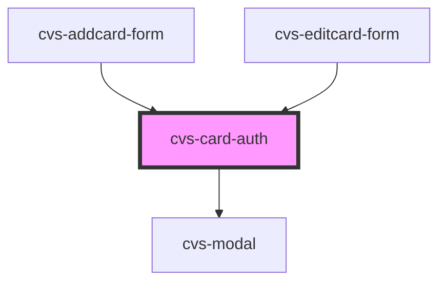

# cvs-card-auth

<!-- Auto Generated Below -->

## Properties

| Property             | Attribute | Description                   | Type                                                                   | Default     |
| -------------------- | --------- | ----------------------------- | ---------------------------------------------------------------------- | ----------- |
| `analyticsModalData` | --        | data to emit via EventEmitter | `{ primary: iAnalytics; secondary: iAnalytics; dismiss: iAnalytics; }` | `undefined` |

## Events

| Event            | Description | Type                   |
| ---------------- | ----------- | ---------------------- |
| `closeAuthModal` |             | `CustomEvent<boolean>` |

## Dependencies

### Used by

 - [cvs-addcard-form](../cvs-addcard-form)
 - [cvs-editcard-form](../cvs-editcard-form)

### Depends on

- cvs-modal

### Graph

----------------------------------------------

*Built with [StencilJS](https://stenciljs.com/)*
