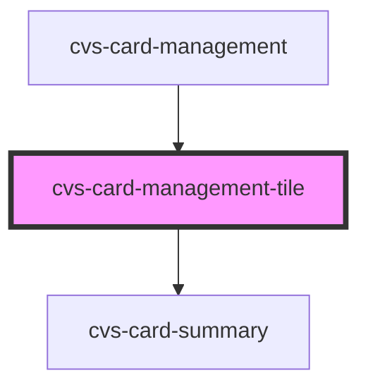

# cvs-card-management-tile

<!-- Auto Generated Below -->

## Properties

| Property    | Attribute    | Description          | Type                  | Default     |
| ----------- | ------------ | -------------------- | --------------------- | ----------- |
| `allowEdit` | `allow-edit` | display edit button  | `boolean`             | `false`     |
| `card`      | --           | card data to display | `CvsCardSummaryProps` | `undefined` |

## Events

| Event               | Description | Type                               |
| ------------------- | ----------- | ---------------------------------- |
| `handleDeleteEvent` |             | `CustomEvent<CvsCardSummaryProps>` |
| `handleEditEvent`   |             | `CustomEvent<CvsCardSummaryProps>` |

## Dependencies

### Used by

 - [cvs-card-management](../cvs-card-management)

### Depends on

- [cvs-card-summary](../cvs-card-summary)

### Graph

----------------------------------------------

*Built with [StencilJS](https://stenciljs.com/)*
