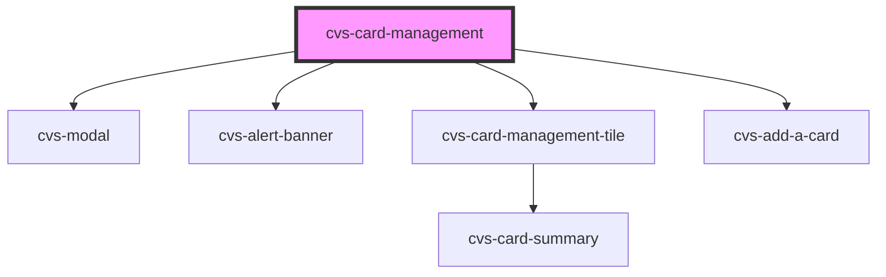

# cvs-card-management

<!-- Auto Generated Below -->

## Properties

| Property       | Attribute       | Description                                                       | Type                           | Default     |
| -------------- | --------------- | ----------------------------------------------------------------- | ------------------------------ | ----------- |
| `addCardText`  | `add-card-text` | text to display for add card                                      | `string`                       | `undefined` |
| `allowEdit`    | `allow-edit`    | display edit button                                               | `boolean`                      | `false`     |
| `cardAdded`    | `card-added`    | Indicates a new card was successfully added; display alert banner | `boolean`                      | `false`     |
| `expiredCards` | `expired-cards` | list of expired cards to display                                  | `CvsCardDataProps[] \| string` | `undefined` |
| `userId`       | `user-id`       | id of user cards                                                  | `string`                       | `undefined` |
| `validCards`   | `valid-cards`   | list of valid cards to display                                    | `CvsCardDataProps[] \| string` | `undefined` |

## Dependencies

### Depends on

- cvs-modal
- cvs-alert-banner
- [cvs-card-management-tile](../cvs-card-management-tile)
- [cvs-add-a-card](../cvs-add-a-card)

### Graph

----------------------------------------------

*Built with [StencilJS](https://stenciljs.com/)*
