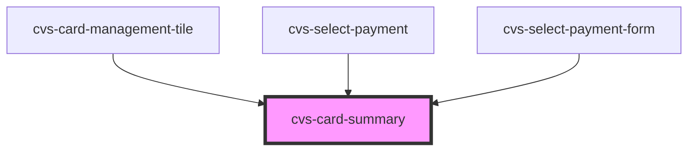

# cvs-card-summary

<!-- Auto Generated Below -->

## Properties

| Property                | Attribute      | Description                                                                            | Type      | Default     |
| ----------------------- | -------------- | -------------------------------------------------------------------------------------- | --------- | ----------- |
| `active`                | `active`       | boolean to intimate whether the card is selected or not                                | `boolean` | `false`     |
| `billingAddress`        | --             | billing address of the given card                                                      | `Address` | `undefined` |
| `cardNum` _(required)_  | `card-num`     | last 4 digits of the card number to display                                            | `string`  | `undefined` |
| `cardType` _(required)_ | `card-type`    | cardType: visa\|mastercard\|discover\|amex etc                                         | `string`  | `undefined` |
| `expDate` _(required)_  | `exp-date`     | expiry date of the given card                                                          | `string`  | `undefined` |
| `isValid`               | `is-valid`     | boolean to intimate if its a valid card considering expiry date                        | `boolean` | `true`      |
| `showDetails`           | `show-details` | boolean to show/hide full details (billing address, etc) for use in certain components | `boolean` | `false`     |

## Dependencies

### Used by

 - [cvs-card-management-tile](../cvs-card-management-tile)
 - [cvs-select-payment](../cvs-select-payment)
 - [cvs-select-payment-form](../cvs-select-payment-form)

### Graph

----------------------------------------------

*Built with [StencilJS](https://stenciljs.com/)*
