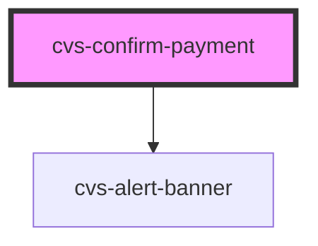

# cvs-confirm-payment

<!-- Auto Generated Below -->

## Properties

| Property              | Attribute        | Description         | Type      | Default     |
| --------------------- | ---------------- | ------------------- | --------- | ----------- |
| `goBack` _(required)_ | `go-back`        | where to go back to | `string`  | `undefined` |
| `selectSuccess`       | `select-success` | if card was added   | `boolean` | `false`     |

## Events

| Event          | Description                                                       | Type               |
| -------------- | ----------------------------------------------------------------- | ------------------ |
| `goBackButton` | event to tell next app to router.push back after payment selected | `CustomEvent<any>` |

## Dependencies

### Depends on

- cvs-alert-banner

### Graph

----------------------------------------------

*Built with [StencilJS](https://stenciljs.com/)*
