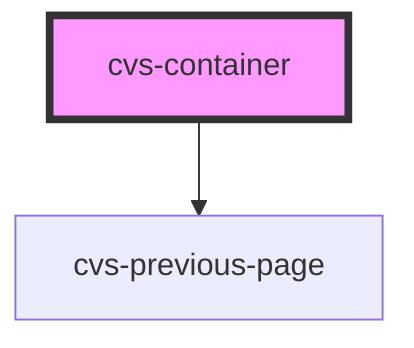

# cvs-container

<!-- Auto Generated Below -->

## Properties

| Property            | Attribute              | Description                                        | Type      | Default     |
| ------------------- | ---------------------- | -------------------------------------------------- | --------- | ----------- |
| `headerImgAltTag`   | `header-img-alt-tag`   | Header Image Alt Tag                               | `string`  | `undefined` |
| `headerImgUrl`      | `header-img-url`       | URL with asset source                              | `string`  | `undefined` |
| `pageTitle`         | `page-title`           | Page title                                         | `string`  | `undefined` |
| `prevPageCustomUrl` | `prev-page-custom-url` | Previous Page Url                                  | `string`  | `undefined` |
| `prevPageName`      | `prev-page-name`       | Previous Page Text                                 | `string`  | `undefined` |
| `showPrevPage`      | `show-prev-page`       | If previous page should be there, fallbacks or not | `boolean` | `undefined` |

## Dependencies

### Depends on

- cvs-previous-page

### Graph

----------------------------------------------

*Built with [StencilJS](https://stenciljs.com/)*
