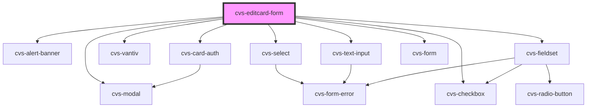

# cvs-editcard-form

<!-- Auto Generated Below -->

## Properties

| Property                   | Attribute       | Description                                                                                                                                                        | Type                       | Default     |
| -------------------------- | --------------- | ------------------------------------------------------------------------------------------------------------------------------------------------------------------ | -------------------------- | ----------- |
| `editCard`                 | `edit-card`     | editCard passed as prop which decides that the form will be using as edit payment card without vantiv or add payment option with vantiv but without hsa/fsa option | `EditCardValues \| string` | `undefined` |
| `noCard` _(required)_      | `no-card`       | noCard passed from url param                                                                                                                                       | `string`                   | `undefined` |
| `noValidCard` _(required)_ | `no-valid-card` | noValidCard passed from url param                                                                                                                                  | `string`                   | `undefined` |
| `token` _(required)_       | `token`         | userId token passed from url param                                                                                                                                 | `string`                   | `undefined` |

## Events

| Event             | Description                                                                   | Type                          |
| ----------------- | ----------------------------------------------------------------------------- | ----------------------------- |
| `cancelRedirect`  | onClick notify next.js app to router.push() to appropriate edit-card page     | `CustomEvent<any>`            |
| `formErrorEvt`    | event emitter fires when errors are present in form                           | `CustomEvent<any>`            |
| `handleAddEvent`  |                                                                               | `CustomEvent<any>`            |
| `handleEditEvent` |                                                                               | `CustomEvent<EditCardValues>` |
| `isValidating`    | Custom event emitter to indicate validation process and trigger loader status | `CustomEvent<ValidateEvent>`  |

## Dependencies

### Depends on

- cvs-modal
- cvs-alert-banner
- cvs-select
- cvs-vantiv
- cvs-text-input
- [cvs-card-auth](../cvs-card-auth)
- cvs-fieldset
- cvs-checkbox
- cvs-form

### Graph

----------------------------------------------

*Built with [StencilJS](https://stenciljs.com/)*
