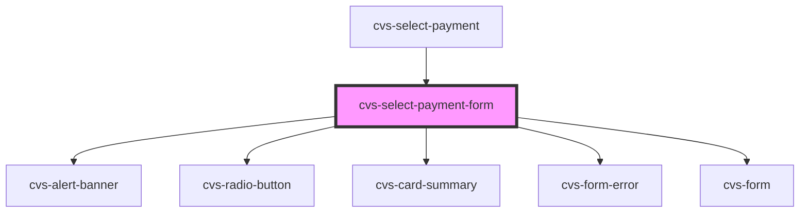

# cvs-select-payment-form

<!-- Auto Generated Below -->

## Properties

| Property       | Attribute       | Description                                             | Type                    | Default     |
| -------------- | --------------- | ------------------------------------------------------- | ----------------------- | ----------- |
| `myChartUrl`   | `my-chart-url`  | url to be passed to error banner to redirect to mychart | `string`                | `undefined` |
| `showContinue` | `show-continue` | show continue button default to true                    | `boolean`               | `true`      |
| `subText`      | `sub-text`      | legend to display in the select card form               | `string`                | `undefined` |
| `userId`       | `user-id`       | encrypted user id                                       | `string`                | `undefined` |
| `validCards`   | --              | list of valid cards to display                          | `CvsCardSummaryProps[]` | `undefined` |

## Events

| Event             | Description                                                  | Type               |
| ----------------- | ------------------------------------------------------------ | ------------------ |
| `cardChangeEvent` |                                                              | `CustomEvent<any>` |
| `cardSelect`      | event emitter handles redirect for user after card selection | `CustomEvent<any>` |

## Dependencies

### Used by

 - [cvs-select-payment](../cvs-select-payment)

### Depends on

- cvs-alert-banner
- cvs-radio-button
- [cvs-card-summary](../cvs-card-summary)
- cvs-form-error
- cvs-form

### Graph

----------------------------------------------

*Built with [StencilJS](https://stenciljs.com/)*
