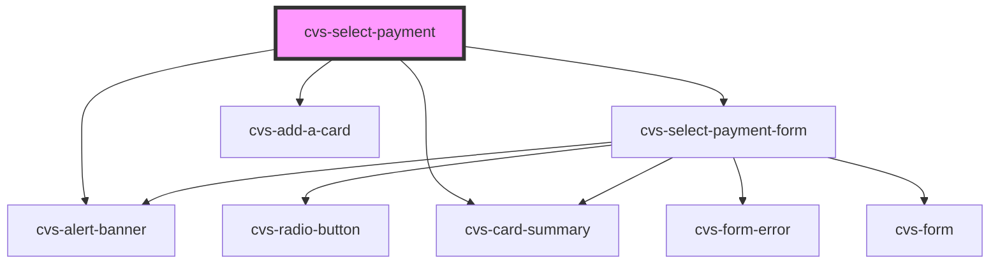

# cvs-select-payment

<!-- Auto Generated Below -->

## Properties

| Property       | Attribute       | Description                                                               | Type                              | Default     |
| -------------- | --------------- | ------------------------------------------------------------------------- | --------------------------------- | ----------- |
| `addCardText`  | `add-card-text` | text to display for add card                                              | `string`                          | `undefined` |
| `cardAdded`    | `card-added`    |                                                                           | `boolean`                         | `undefined` |
| `correctFlow`  | `correct-flow`  | show an error message if going to select-payment from manage-payment flow | `boolean`                         | `undefined` |
| `expiredCards` | `expired-cards` | list of expired cards to display                                          | `CvsCardSummaryProps[] \| string` | `undefined` |
| `hideHeader`   | `hide-header`   | option to hide headers                                                    | `boolean`                         | `false`     |
| `myChartUrl`   | `my-chart-url`  | Previous Page Url to redirect on error to mychart                         | `string`                          | `undefined` |
| `showContinue` | `show-continue` | show continue button default to true                                      | `boolean`                         | `true`      |
| `subText`      | `sub-text`      | legend to display in the select card form                                 | `string`                          | `undefined` |
| `userId`       | `user-id`       | userId for api submission                                                 | `string`                          | `undefined` |
| `validCards`   | `valid-cards`   | list of valid cards to display                                            | `CvsCardSummaryProps[] \| string` | `undefined` |

## Events

| Event                   | Description                                             | Type               |
| ----------------------- | ------------------------------------------------------- | ------------------ |
| `routeToCardManagement` | event emitter handles directing user to card management | `CustomEvent<any>` |

## Dependencies

### Depends on

- cvs-alert-banner
- [cvs-select-payment-form](../cvs-select-payment-form)
- [cvs-add-a-card](../cvs-add-a-card)
- [cvs-card-summary](../cvs-card-summary)

### Graph

----------------------------------------------

*Built with [StencilJS](https://stenciljs.com/)*
